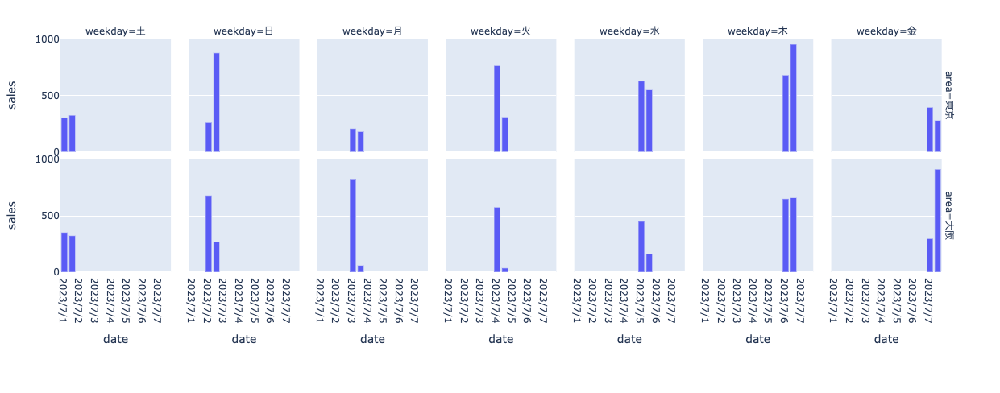

### 内容

- data/sale.csv を pandas で読み込んで plotly でグラフ化、dash で viewer をローカルサーバー起動

- viewer の画像
  

### LICENSE

- MIT

### コマンド

```sh
# 仮想環境の作成
python3 -m venv .venv

# 仮想環境のアクティベート
source .venv/bin/activate

# pip のアップグレード
python3 -m pip install --upgrade pip

# ライブラリのインストール
pip install -r requirements.txt
```

```sh
# サンプルコードの実行
python main.py

# ローカルサーバーのURL
http://127.0.0.1:8050/
```

```sh
# pip-tools による requirements.txt の作成
pip-compile requirements.in
```
